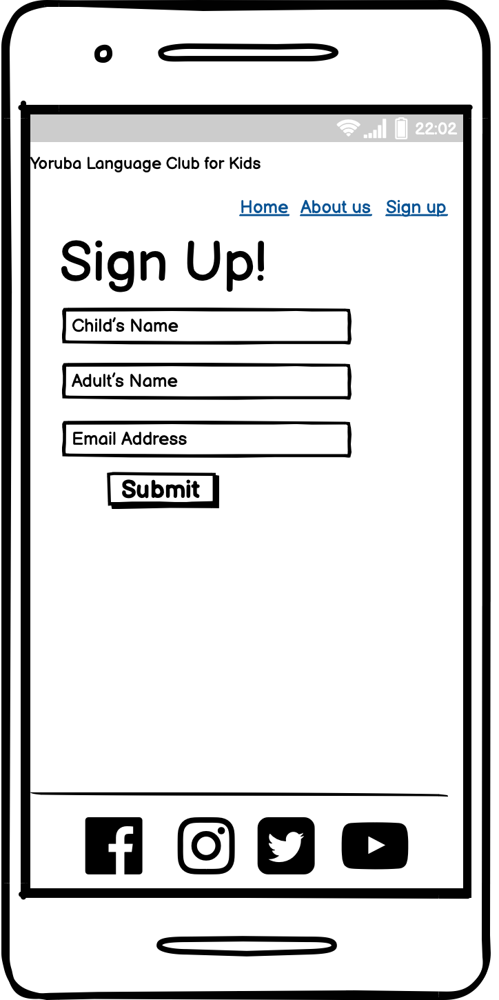

# Yoruba Language Club for Kids

This project is focused on on a website that teaches kids between the ages of 3-15years on how to read and speak the indigenous Yoruba Language. Our website is built for parents, guardians, children and schools that are interested in sustaining the indigenous language.

 The users will find all relevant information about the Yoruba Language club; our offerings, meeting times, and a sign up form. 

 The idea behind the project is to be able to sustain the yoruba language for generations to come. 

## Our Main goal:
<ul>
<li> to sustain the indigenous yoruba langauage
<li> to support parents, guardians and schools that wants their kids to learn the language.
<li> to be accessible to our target audience in their various locations.
</ul>

## Wireframes

### Content Strategy
<ul>
<li> user-friendly
<li> stand-out design with beautiful colors
<li> easy to use navigations
</ul>

### Target Audience:
Our website is targeted at young parents, guardians who would like their kids to learn the yoruba language.

## Features
<ul>
<li> Navigation
    <ul>
    <li> This features at the top of the page, it shows the club name at the left corner: Yoruba Language Club that links to the top of the page.
    <li> The other navigation links are to the right: Home, About us and Sign up. The home is the landing page, the about us and sign up links to another pages set up for About us and Sign up Form.
    <li> The navigation tells the user the name of the club and website and makes the differnt pages easy to find.
    <li> Users can easily navigate back to the main page from the About us page and sign up page.
    </ul> 
<li> The Header
    <ul>
    <li> The header shows the name of the club using a very dark shade of lemon color.
    <li> It explains the age brackets for the kids 3- 15years.
    <li> It also features a provoking thought on sustaing the yoruba club which also has an embedded link to the About us page.
    <li> The section provides users with clear information about what the site is and who the club is for.
    </ul>
<li> Social media links
    <ul> 
    <li> This section has the social media icons, so users can find more information about the yoruba club on facebook, instagram, twitter and youtube.
    <li> The icons when click on takes the user to the respective url.
    <li> It gives the users ability to find and contact the club if they need to.
    </ul>
<li> The About us
    <ul> 
    <li> The About us section gives details about what the club offers, their members and the club's schedule.
    <li> This section shows the user the important information they need to know about the club.
    </ul>
<li> The Sign up Form
    <ul>
    <li> it allows users to enroll and join our club
    </ul>
</ul>

## Wireframes

